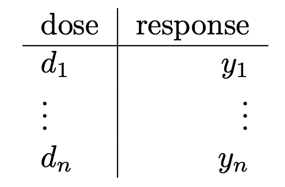

This page shows how to start using the ENDS to generate a nonparametric fit to drug dose response drug data.

### 1. Upload file 

The application accepts one of the file formats espcified below.

​	1.1  Include the doses in micromolars $\mu M$ and  either mean response or single response per dose. 

​	1.2  Include the doses in micromolars $\mu M$ and multiple responses per dose. 

