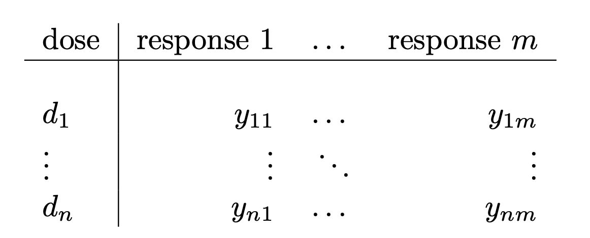

This page shows how to start using the ENDS to fit parametric and nonparametric drug dose response curves to data.

### 1. Upload file 

The application accepts a *.csv* file with the format as follows:

- Include the doses in micromolars ($\mu M$)​  in the first column and one or multiple responses per dose in the next collumns.

