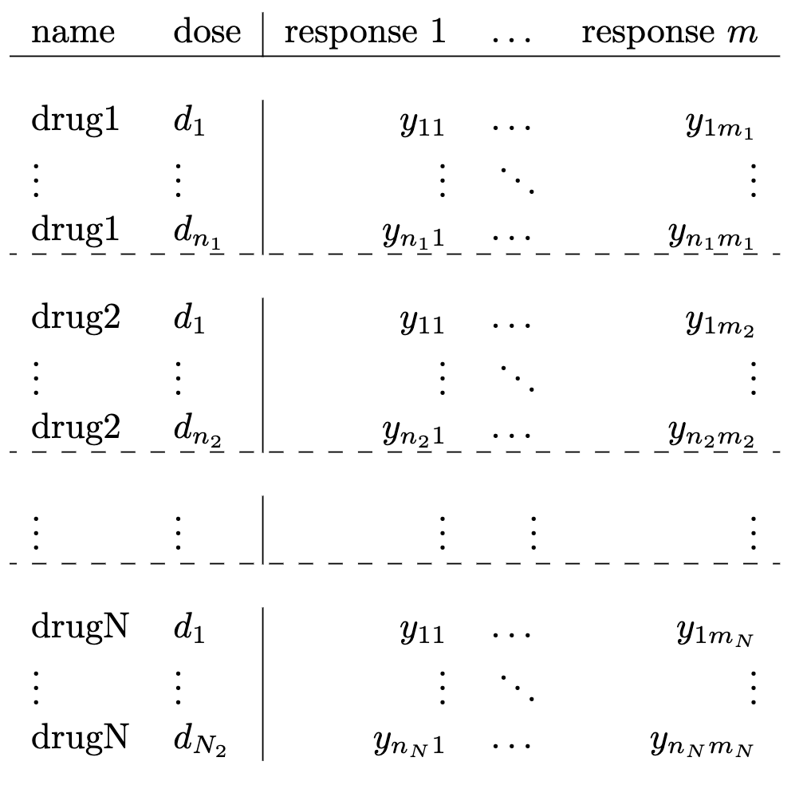

###  Input  

This page shows how to start using the ENDS to fit parametric and nonparametric drug dose response curves to data. The application accepts as input upload a *.csv* file with the format below. It requieres the doses in micromolars ($\mu M$)​  in the first column and one or multiple responses per dose in the next columns.

