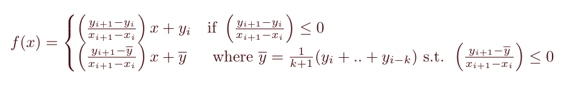

#### Nonparametric Monotonic *(NPM)*

 This alternative to the  nonparametric spline imposes a monotone (non increasing) constrain. If the spline between two doses does not have a negative slope, then the average of the previous doses is recursively calculated until the next spline has a negative slope, which connects the average with the next data point. It is also called isotonic regression in some literature. The cases are:

*k* is the smallest integer such that the slope is negative.