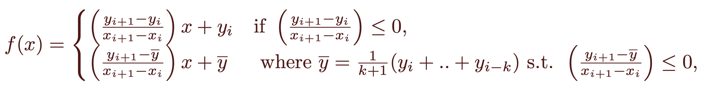

#### Nonparametric Monotonic *(npM)*

 This alternative to the nonparametric spline imposes a monotone (non increasing) constrain. If the spline between two doses does not have a negative slope, then the average of the previous doses is recursively calculated until the next spline has a negative slope, which connects the average with the next data point. It is also called isotonic regression in some literature. 

where  *k* is the smallest integer such that the slope is negative. It has been shown that this fit is the one that minimzed the squared errors $\|y-f(x)\|^2$ with the constrain that $f(x_i)\geq f(x_{i+1})$.

This fit will always produce a non increasing fit, even in cases where the logistic model or the nonparametric Bayesian produce an incrasing fit.

For the calculation of the effective doses at level $p\in (0,1)$ we find the unique value in the x-axis such that 
$$
f(IC_{p}) = (\max y + \min y) p
$$
 

