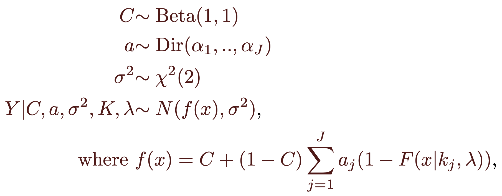

#### Nonparametric Bayesian Model *(NPB)*

This nonparametric model connects a collection of normal cumulative distribution functions together using a Bayesian model to solve for the parameters.

#### Details

The parameters knots $K$ and variance $\lambda$ are given apriori. $K$ regulates where the distribution functions will be centered and $\lambda$ the variance of the distributions, we choose $K$ to be the doses available and $lambda$ is found by grid search, chosen as the one with  least square error. Namely, points $(x_i, y_i)$ for $i=1..n$, with knots $K=\{k_i\}_{i=1}^J$ and parameter $\lambda>0$ we will model the relation between *x* and *y* with the Bayesian hierarchical model;

  

The weights a are non-negative and sum up to one and and $F(x|k_j, \lambda)$ is the cumulative distribution function of a Gaussian random variable with mean $k_j$ and variance $\lambda$. We can use MCMC to sample from the posterior distribution
$$
p( C ,a,\sigma^{2} \mid y,x,K,\lambda)
$$
 An inhouse implementation of the Metropolis-Hastings (MH) sampling algorithm is used for posterior inference. available at [https://github.com/AmiryousefiLab/ENDS](https://github.com/AmiryousefiLab/ENDS). Knots are chosen at the unique doses and the parameter  $\lambda$ is chosen as the value with minimum squared error over a grid of values including the mean variance estimate of the samples at each knot. We also chose a uniform Dirichlet distribution as prior for $a$, this is $a\sim Dir(1,..,1)$, slightly different model choice from  ["Roerink et al. (2018)"](https://www.tandfonline.com/doi/abs/10.1080/10807039.2021.1956298) where a stick breaking process is used to generate the weights of the Dirichlet distribution, note that a stick breaking process would force the weights to be decreasing in magnitude with probability one, we think this assumption is too restrictive, so our approach assumes a uniform Dirichlet prior which allows  the weightss to be any magnitude as long as they are non negative and sum up  to one.

Once the samples of the posterior distribution are obtained we drop out the first half of the observations by default. The estimate of the parameters is the mean value, following the procedure done in the previously cited paper ["Roerink et al. (2018)"](https://www.tandfonline.com/doi/abs/10.1080/10807039.2021.1956298). Once we have the mean estimates of the parameters $\hat{C}$, $\hat{a}$, $\hat{\sigma}^2$ what we show in the plots is the function $\hat{f}(x)=\hat{C} + (1-\hat{C})\sum_{j=1}^J \hat{a}_j (1-F(x|k_j,\lambda))$. The $IC_{50}$ value is calculated from this function as
$$
f(IC_{50}) = \frac{1}{2}\left(\max_{x_1\leq x\leq x_n}{f(x)}+\min_{x_1\leq x\leq x_n}{f(x)}\right),
$$

and for any $p\in (0,1)$ we have $IC_p$ obtained as the value such that
$$
f(IC_{p}) = \min_{x_1\leq x\leq x_n}f(x)+p\left(\max_{x_1\leq x\leq x_n}{f(x)}-\min_{x_1\leq x\leq x_n}{f(x)}\right) .
$$
Note that the Bayesian approach would allow us to obtain for each sample of parameters an $IC$ and then have a distribution for it, from which we could take the mean, but it was decided to obtain the $IC$ from the estimates such that the $IC_{50}$ would be marked on the curve on the plot. 

The MH algorithm uses as priors normal distributions with parameters mannually found such that the posterior sampling rate was above 30% for all parameters. Note that we have to use a tranformation of the parameters such that they are in the correct range, for $\sigma^2$ we used an exponential function, for $C$ a logistic tranformation and for $a$ a softmax tranformation, the change of variables rule was used to update the priors such that the MH worked correctly, adding the absolute value of the determinant of the Jacobian matrix. Lastly we chose an enough chain lenghth such the the $\hat{R}$ statistic is close to one for each parameter, this indicates that several chains are converging to the same values, so the chains are long enough.

