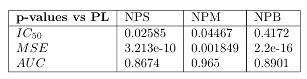

### Supplemantary Material

For all the data found in ["Intra-tumour diversification in colorectal cancer at the single-cell level"](https://www.nature.com/articles/s41586-018-0024-3), we have fitted each of the four models *npS*,*npM*, *npB* and *pL* to each combination of drug, patient, treatment and sample. For *npB* we followed the aforementioned procedure of fixing the knots of the function at the doses and choosing the variance parameter of the Normal CDF from a grid of values including the max-likelihood estimate, as the one which minimized the squared error, and then computed the posterior parameters with the Metropolis-Hastings algorithm for 10,000 iterations. We found the $IC_{50}$, $MSE$ and $AUC$ for each of the models which are shown in the figures below in violin plots. Note that we have included a box plot within the violin plots to showcase where the median, first and fourth quantiles are, and outliers are marked with strong dots. Outliers are those that reside outside the first quantile minus 1.5 times the interquartile range, or the third quantile plus 1.5 the interquartile range. 

Using a Shapiro test we reject the hypothesis of normality, so we use the nonparametric Wilcoxon test, to compare whether the mean of nonparametric models are statistical different from the parametric logistic model. The results of the tests are shown in the table below. In summary the $IC_{50}$ of NPS and NPM are slightly smaller than the Logistic model. The mean squared error of $NPS$ is the smallest as the mean is the statistic that minimizes the mean squared error, and so its MSE is different statistically from the Logistic model, the NPB has a significantly bigger MSE than the Logistic model. The AUC are similar in all the models. 

